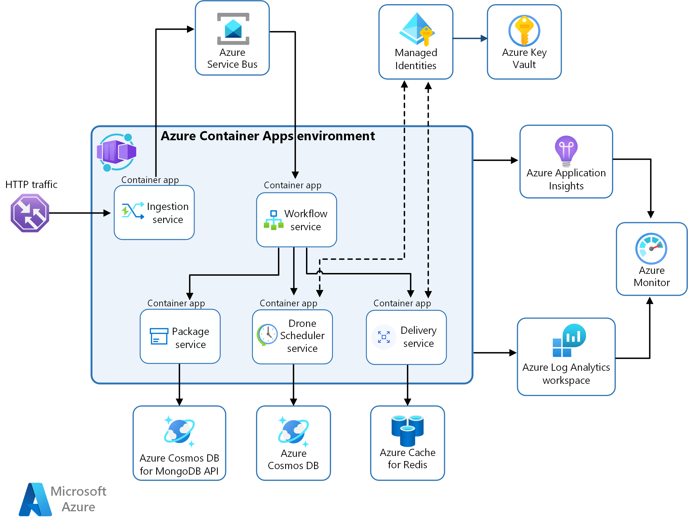

# Drone Delivery Application with Azure Container Apps  

This repository contains the infrastructure-as-code (IaC) resources, scripts, and documentation for deploying a microservices-based drone delivery application using **Azure Container Apps**.  

## Overview  

The application simulates a drone delivery service, allowing users to request drone pickups and deliveries. The architecture leverages Azure services to provide a scalable, serverless environment for microservices with minimal operational overhead.  

### Features  
- **Serverless microservices** with Azure Container Apps.  
- **Built-in scalability** with event-driven autoscaling powered by KEDA.  
- **Secure integrations** using Managed Identities for Azure Key Vault and Azure Container Registry.  
- **Simplified monitoring** with Azure Application Insights and Log Analytics.  
- **Infrastructure automation** with Bicep templates.  

### Architecture  

The architecture includes the following components:  
1. **Containerized Microservices**:  
   - Ingestion Service  
   - Workflow Service  
   - Drone Scheduler Service  
   - Package Service  
   - Delivery Service  

2. **Azure Services**:  
   - **Azure Cosmos DB** (for MongoDB API and SQL API).  
   - **Azure Cache for Redis** (caching).  
   - **Azure Service Bus** (event-driven communication).  
   - **Azure Key Vault** (secure secret management).  
   - **Azure Monitor** and **Application Insights** (monitoring and observability).  

  

### Repository Structure  

```plaintext  
.  
├── README.md                        # Documentation of the architecture and setup steps  
├── bicep/  
│   ├── main.bicep                   # Main Bicep template to orchestrate the deployment  
│   ├── modules/                     # Directory for reusable modules  
│   │   ├── container-app.bicep      # Module for deploying individual container apps  
│   │   ├── cosmos-db.bicep          # Module for deploying Azure Cosmos DB  
│   │   ├── redis-cache.bicep        # Module for deploying Azure Cache for Redis  
│   │   ├── key-vault.bicep          # Module for deploying Azure Key Vault  
│   │   ├── service-bus.bicep        # Module for deploying Azure Service Bus  
│   │   ├── application-insights.bicep  # Module for deploying Azure Application Insights  
│   │   ├── log-analytics.bicep      # Module for deploying Azure Log Analytics  
│   │   ├── managed-identity.bicep   # Module for creating managed identities  
│   └── parameters/  
│       ├── dev.parameters.json      # Parameters for development environment  
│       ├── staging.parameters.json  # Parameters for staging environment  
│       ├── prod.parameters.json     # Parameters for production environment  
├── workflows/                       # Directory for workflow definitions  
│   ├── deployment-workflow.yaml     # Optional: CI/CD pipeline for deployment  
│   └── monitoring-workflow.yaml     # Optional: Workflow for monitoring setup  
├── scripts/                         # Helper scripts for automation  
│   ├── deploy.sh                    # Shell script for deploying the Bicep templates  
│   ├── destroy.sh                   # Shell script for tearing down the deployment  
├── docs/                            # Additional documentation  
│   ├── architecture-diagram.png     # Architecture diagram  
│   ├── setup-guide.md               # Guide on setting up the environment  
│   ├── troubleshooting.md           # Troubleshooting common issues  
└── .gitignore                       # Git ignore file for ignoring sensitive files  
```  

### Getting Started  

#### Prerequisites  
- Azure CLI installed locally.  
- Bash or any POSIX-compatible shell.  
- An active Azure subscription.  

#### Deployment  

To deploy the infrastructure, run the following commands:  

```bash  
# Login to Azure  
az login  

# Create a resource group (if not already created)  
az group create --name "drone-delivery-rg" --location "EastUS"  

# Deploy the infrastructure using Bicep  
bash scripts/deploy.sh  
```  
